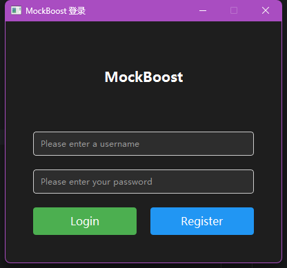
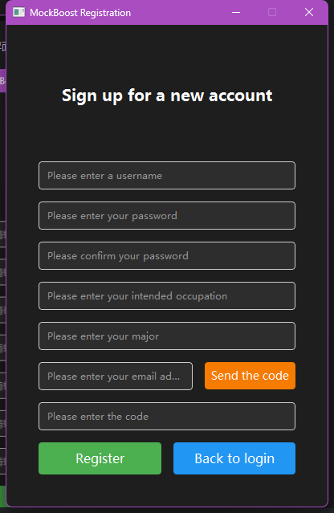
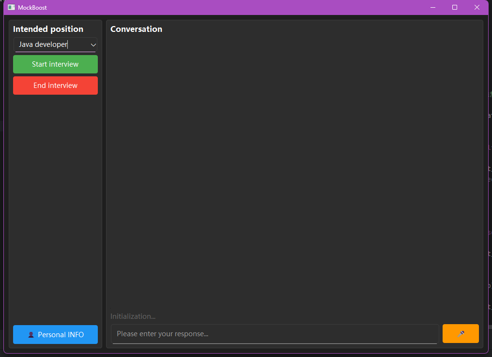
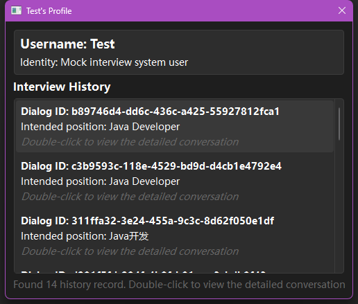
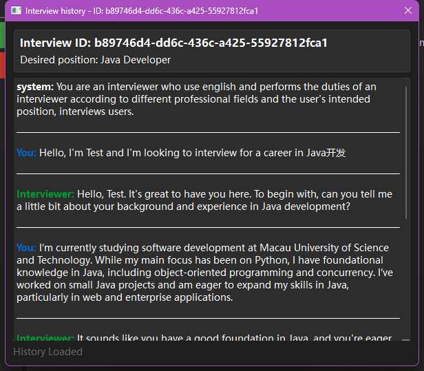

# MockBoost

## 项目简介

MockBoost是一个智能模拟面试系统，旨在帮助求职者提升面试技能。系统利用大型语言模型和语音交互技术，为用户提供真实的面试体验，支持多种职业方向的模拟面试，包括Java开发、Python开发、前端开发和算法工程师等岗位。

## 主要功能

- **多职位面试模拟**：支持多种职位的面试模拟
- **智能对话系统**：基于大型语言模型的智能对话，提供真实的面试体验
- **语音交互**：集成TTS（文本转语音）功能，支持语音输出，增强交互体验
- **对话记忆**：使用Redis数据库存储和检索对话历史，实现上下文感知的交互
- **用户管理**：支持用户注册、登录和个人信息管理
- **面试评估**：提供面试表现的评估和反馈

## 项目展示
1. 登陆界面



2. 注册界面



3. 运行界面


4. 个人信息


5. 对话历史




## 技术架构

- **前端界面**：基于PyQt6构建的桌面应用界面
- **对话模型**：集成DeepSeek-7B大型语言模型
- **记忆存储**：使用Redis向量数据库存储对话记忆
- **语音合成**：使用Coqui TTS进行文本到语音的转换

## 项目结构

```
MockBoost/
├── Frame/            # 用户界面相关代码
├── Main/             # 核心业务逻辑和模型交互
├── TTSandASR/        # 语音合成和识别相关代码
├── db/               # 数据库相关代码
├── Training/         # 模型训练及数据
└── requirements.txt  # 项目依赖
```

## 安装指南

### 环境要求

- Python 3.11
- 支持的操作系统：Windows、macOS、Linux
- N卡限定

### 安装步骤

1. 克隆仓库到本地

```bash
git clone https://github.com/yourusername/MockBoost.git
cd MockBoost
```

2. 安装依赖包

```bash
pip install -r requirements.txt
```

## 使用方法

1. 启动应用

```bash
python -m Frame.main_frame
```

2. 登录系统
   - 使用已有账号登录或注册新账号

3. 选择面试模式
   - 从下拉菜单中选择或输入面试职位（Java开发、Python开发等）
   - 点击"开始面试"按钮开始模拟面试

4. 进行面试对话
   - 系统会通过语音和文字提出面试问题
   - 在输入框中输入您的回答或语音输入并按回车键提交
   - 系统会根据您的回答进行智能响应

5. 结束面试
   - 点击"结束面试"按钮结束当前面试
   - 系统会提供面试表现的评估和反馈

## 核心模块说明

### 对话记忆管理

系统使用Redis数据库存储和检索对话历史，实现上下文感知的交互。核心实现在`Main/DeepSeek.py`中。

### 语音合成

系统使用Coqui TTS进行文本到语音的转换，增强交互体验。核心实现在`TTSandASR/ChatTTs.py`中的`ChatTTS`类。

### 用户界面

系统使用PyQt6构建桌面应用界面，提供友好的用户体验。核心实现在`Frame/main_window.py`中的`MainWindow`类。

## 扩展开发

### 集成语音转文本对话功能

可以通过集成语音转文本对话功能做到更加真实的面试。

### 扩展模型支持

如需添加新的语言模型支持，请参考`Main/DeepSeek.py`和`Main/Thread/DataThread`的实现方式。

### 数字人支持

添加数字人使得模拟更加真实。

## 证书许可
本项目采用 MIT 许可证，具体内容请见 [LICENSE](LICENSE) 文件。

## 联系方式

如有任何问题或建议，请通过以下方式联系我们：

- 项目维护者：[LiaoJiongyi](2750768449@qq.com)
- 项目仓库：[GitHub](https://github.com/ruotianwuf/MockBoost)
